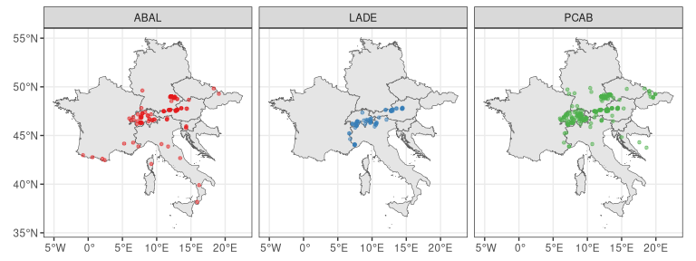
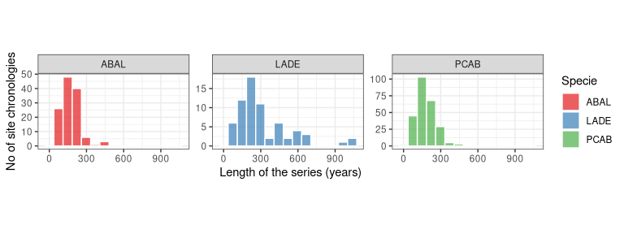
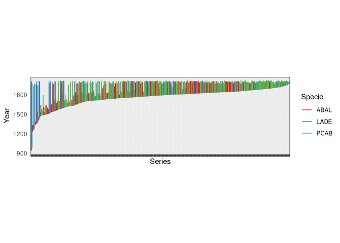
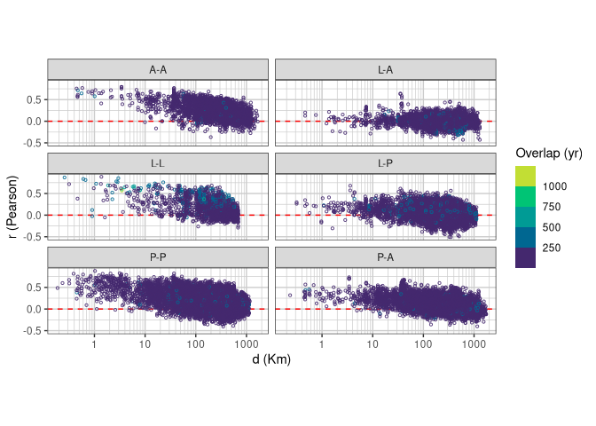
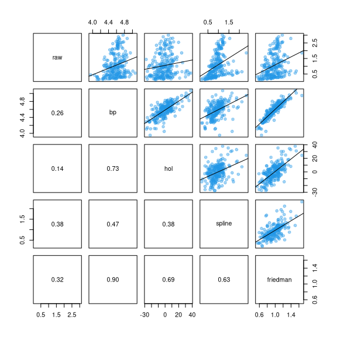
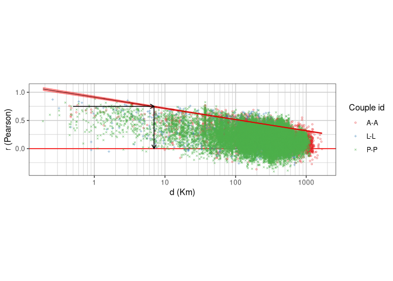
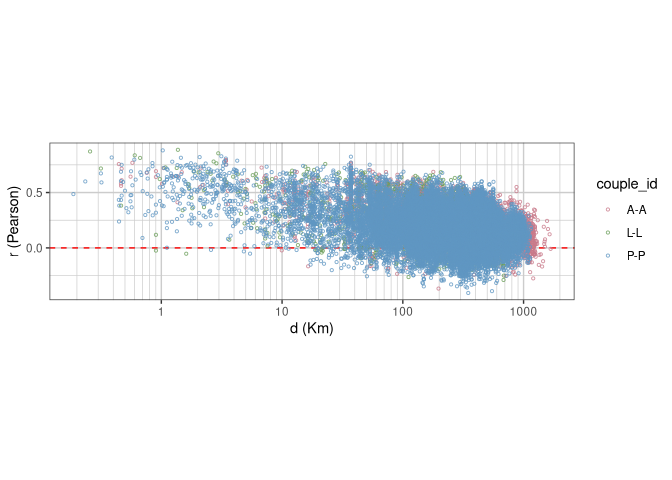
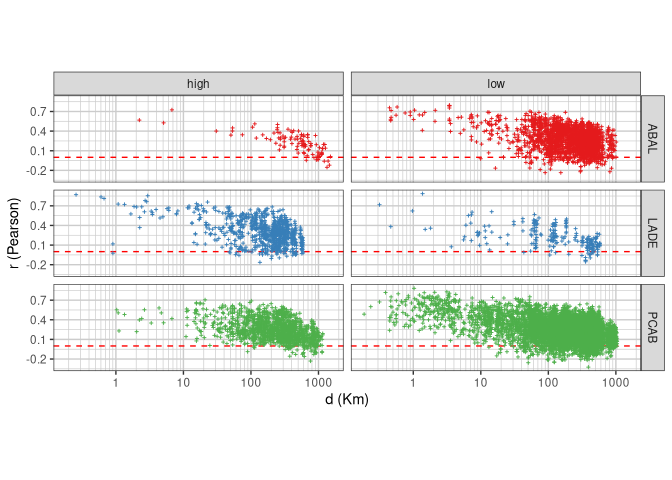

readme
================
Pietro Franceschi
2024-05-27

## Introduction

This md file documents the data analysis workflow used to produce the
results presented in the paper *Correlation between tree-ring series as
a dendroprovenancing evaluation tool* by M. Bernabei and P. Franceschi.

## Includes

This is the set of libraries required to perform the analyses

``` r
library(dplR)                
library(tidyverse)
library(sf)
library(knitr)
library(magrittr)
library(quantreg)
library(colorspace)
library(jtools)
library(broom)
```

## Data

11,972 individual, raw and georeferenced tree ring series, referring to
three important Alpine species, Norway spruce (Picea abies Karst.,
PCAB), larch (Larix decidua Mill., LADE) and silver fir (Abies alba
Mill., ABAL), were downloaded from the ITRDB site ([International Tree
Ring Data Bank, United States’ National Oceanic and Atmospheric
Administration Paleoclimatology Program and World Data Center for
Paleoclimatology](https://www.ncei.noaa.gov/products/paleoclimatology/tree-ring)
(Guiterman et al., 2024).

The data were organised into a complete tibble which is made available
in the repository (`full_series.RData`).

``` r
## load the dataset
load("full_series.RData")

## print the column names
colnames(dat)
```

    ## [1] "meta"       "study_code" "specie"     "geotype"    "minelev"   
    ## [6] "maxelev"    "geometry"   "rwl"

- `meta`: the metainformation present in the NOAA db.
- `study_code`: the identifier of the study
- `specie`: the tree specie code
- `geotype`: the type of geographical object (here always a POINT)
- `minelev`,`maxelev`: the altitude boundaries of the series, if present
- `geometry`: the coordinates of the series
- `rwl`: the rwl object containing the single tree ring data

For plotting a shapefile of Europe is also included

``` r
load("euro_shape.RData")
```

## Specific R functions

To better streamline the analysis workflow we coded a set of functions
which are included in the `additional_functions.R` file. In particular:

- `calculate_matching`: This function efficiently calculates matching
  metrics between different series organized in a rwl object.
- `averager`: uses the `chron` function of `dplR` to calculate an
  *average* rwl object from a sett of tree ring chronologies
- `log10_minor_break` : allows to add log spaced grid to a ggplot object

``` r
source("additional_functions.R")
```

## Series pre-processing

The objective of this section is:

- detrend and combine the individual tree ring data in a coherent way
- assess the dataset distribution in terms of replication, length of the
  series, species distribution

Let’s start with an initial assessment of the size of the dataset. We
are dealing here with

``` r
nrow(dat)
```

    ## [1] 447

series with the following species distribution

``` r
table(dat$specie)
```

    ## 
    ## ABAL LADE PCAB 
    ##  124   67  256

In terms of spatial coverage at the continental scale

``` r
geo_area %>% 
  ggplot() + 
  geom_sf() + 
  geom_sf(data = dat, aes(col = specie), size = 1, alpha = 0.5) + 
  scale_color_brewer(palette = "Set1", name = "Specie") + 
  facet_wrap(~specie) + 
  theme_bw() + 
  theme(legend.position = "none")
```

<!-- -->

We also calculate the total number of tree ring series we are dealing
with

``` r
## add a column withe the samples per series
dat <- dat %>% 
  mutate(nsamp = map_int(rwl, ~ncol(.x))) 

## calculate the total number of tree ring series
sum(dat$nsamp)
```

    ## [1] 11972

``` r
dat %>% 
  ggplot() + 
  geom_histogram(aes(x = nsamp, fill = specie), col  ="white", alpha = 0.7, bins  = 10) + 
  scale_fill_brewer(palette = "Set1", name = "Specie") + 
  geom_vline(xintercept = 20, col = "red", lty = 2) +
  facet_wrap(~specie, scales = "free_y") + 
  theme_bw() + 
  scale_x_log10(minor_breaks=log10_minor_break()) + 
  xlab("Log (number of samples)") +
  ylab("No of site chronologies") +
  theme(aspect.ratio = 0.5)
```

<!-- -->

So we see that on average we are dealing with around 25 samples per
series. Here a table with a more complete summary of the series
statistics

``` r
dat %>% 
  group_by(specie) %>% 
  st_drop_geometry() %>% 
  summarise(min_samp = min(nsamp),
            max_samp = max(nsamp),
            mean_nsamp = mean(nsamp)) %>% 
  kable("pipe")
```

| specie | min_samp | max_samp | mean_nsamp |
|:-------|---------:|---------:|-----------:|
| ABAL   |        2 |     1248 |   27.61290 |
| LADE   |        5 |      141 |   29.14925 |
| PCAB   |        1 |      324 |   25.76172 |

We now detrend all the individual tree series by a Friedman
supersmoother and then we calculate the average chronology of the
detrended series.

We have a limited numbers of warnings 22 out of 12000 not a lot I would
say. The problem is in general due to the presence of bumpy trends that
cannot be efficiently eliminated.

And we arrange everything into two big master objects

``` r
master_d <- combine.rwl(dat$mean_chron_d)
```

Can we say something about the length of the master?

``` r
master_d %>% 
  rownames_to_column("year") %>% 
  mutate(year = as.numeric(year)) %>% 
  mutate(across(-year, ~ as.numeric(!is.na(.x)))) %>% 
  pivot_longer(-year, names_to = "study_code") %>% 
  filter(value > 0) %>% 
  group_by(study_code) %>% 
  summarise(serie_length = length(year)) %>% 
  left_join(dat %>% select(study_code, specie)) %>% 
  ggplot() + 
  geom_histogram(aes(x = serie_length, fill = specie), col  ="white", alpha = 0.7, bins  = 15) + 
  scale_fill_brewer(palette = "Set1", name = "Specie") + 
  facet_wrap(~specie, scales = "free_y") + 
  theme_bw() + 
  xlab("Length of the series (years)") + 
  ylab("No of site chronologies") +
  theme(aspect.ratio = 0.5)
```

    ## Joining with `by = join_by(study_code)`

<!-- -->

As last step of exploratory analyssi we shoe the full extent of the
overall dataset

``` r
master_d %>% 
  rownames_to_column("year") %>% 
  mutate(year = as.numeric(year)) %>% 
  mutate(across(-year, ~ as.numeric(!is.na(.x)))) %>% 
  pivot_longer(-year, names_to = "study_code") %>% 
  filter(value > 0) %>% 
  group_by(study_code) %>% 
  summarise(serie_length = length(year)) %>% 
  left_join(dat %>% select(study_code, specie)) %>% 
  group_by(specie) %>% 
  summarise(min_length = min(serie_length),
            max_length = max(serie_length),
            mean_length = mean(serie_length)) %>% 
  kable("pipe")
```

    ## Joining with `by = join_by(study_code)`

| specie | min_length | max_length | mean_length |
|:-------|-----------:|-----------:|------------:|
| ABAL   |         46 |        424 |    174.2097 |
| LADE   |         43 |       1062 |    320.0896 |
| PCAB   |         24 |        699 |    178.8242 |

We now need a plot to show the full set of series …

``` r
master_d %>% 
  rownames_to_column("year") %>% 
  mutate(year = as.numeric(year)) %>% 
  mutate(across(-year, ~ as.numeric(!is.na(.x)))) %>% 
  pivot_longer(-year, names_to = "study_code") %>% 
  filter(value > 0) %>% 
  group_by(study_code) %>% 
  summarise(y_s = min(year), y_m = max(year)) %>% 
  left_join(dat %>% select(study_code, specie)) %>%
  arrange(y_s) %>% 
  mutate(study_code = factor(study_code, levels = study_code)) %>% 
  ggplot() + 
  geom_segment(aes(x = y_s, xend = y_m, y = study_code, yend = study_code, col = specie), lwd = 0.5) + 
  coord_flip() + 
  scale_color_brewer(palette = "Set1", name = "Specie") + 
  theme_bw() + 
  xlab("Year") + 
  ylab("Series") +
   theme(axis.text.x=element_blank(),
         axis.ticks.y=element_blank(),
        aspect.ratio = 0.3
        )
```

    ## Joining with `by = join_by(study_code)`

<!-- -->

## Correlation analysis of the series

Here we calculate the matching among all masters, to be conservative we
consider only couples which are superimposing more than 50 years

``` r
mtc_d <- calculate_matching(master_d, sup = 50)
```

``` r
head(mtc_d) %>% 
  kable("pipe")
```

| lng | cor | series             |
|----:|----:|:-------------------|
|   0 |  NA | germ065\_\_germ066 |
|   0 |  NA | germ065\_\_germ067 |
|   0 |  NA | germ065\_\_germ068 |
|   0 |  NA | germ065\_\_germ069 |
|   0 |  NA | germ065\_\_germ070 |
|   0 |  NA | germ065\_\_germ071 |

To investigate the association between similarity and distance we also
calculate the physical distance between the set of points

``` r
dist_mat <-  dat%>% 
  st_distance()/1000
rownames(dist_mat) <- dat$study_code
colnames(dist_mat) <- dat$study_code
```

We now combine the spatial and dendrochronological similarity, also
keeping track of the specied of the couples which is taken from the
`dat` tibble

``` r
mtc_d <- mtc_d %>% 
  separate(series, into = c("s1","s2"), sep = "__") %>% 
  na.omit() %>% 
  mutate(d = map2_dbl(s1,s2, ~ dist_mat[.x,.y])) %>% 
  left_join(dat%>% st_drop_geometry() %>% 
              select(study_code,specie), by = c("s1" = "study_code")) %>% 
  left_join(dat %>% st_drop_geometry() %>% 
              select(study_code,specie), by = c("s2" = "study_code")) %>% 
  mutate(couple_id = case_when(specie.x == "LADE" & 
                                 specie.y == "LADE" ~ "L-L",
                               specie.x == "PCAB" & 
                                 specie.y == "PCAB" ~ "P-P",
                               specie.x == "ABAL" & 
                                 specie.y == "ABAL" ~ "A-A",
                               specie.x == "LADE" & 
                                 specie.y == "PCAB" ~ "L-P",
                               specie.y == "LADE" & 
                                 specie.x == "PCAB" ~ "L-P",
                               specie.x == "LADE" & 
                                 specie.y == "ABAL" ~ "L-A",
                               specie.y == "LADE" & 
                                 specie.x == "ABAL" ~ "L-A",
                               specie.x == "PCAB" & 
                                 specie.y == "ABAL" ~ "P-A",
                               specie.y == "PCAB" & 
                                 specie.x == "ABAL" ~ "P-A",
                              
                               )) 
```

And now we make a plot organized by specie

``` r
mtc_d %>% 
  filter(d > 0) %>% 
  mutate(couple_id = factor(couple_id, 
                            levels = c("A-A","L-A","L-L","L-P","P-P","P-A"))) %>% 
  #mutate(length_tile = factor(cut(lng,2))) %>% 
  ggplot() + 
  geom_hline(yintercept = 0, col  ="red", lty = 2) + 
  geom_point(aes(x = d, y = cor, col = lng), alpha = 0.9, pch = 1, size = 0.8) + 
  scale_color_binned_sequential(palette = "viridis", rev = FALSE, name = "Overlap (yr)") + 
  facet_wrap(~couple_id, ncol = 2) + 
  xlab("d (Km)") + 
  ylab("r (Pearson)") + 
  scale_x_log10(minor_breaks=log10_minor_break()) +
  theme_bw() + 
  theme(
        panel.grid.major=element_line (colour="gray80"), 
        panel.grid.minor=element_line(colour="gray80"),
        aspect.ratio = 0.3)
```

<!-- -->

The plot shows the expected trend. The correlation increases at small
distances and the extent of this association depends on the nature of
the couple. In all cases, the vertical cloud @1e-01 shows the
distribution of the correlation measured for masters assigned to the
same spatial location.

Here we also propose a way to identify a reasonable distance starting
from a measure of correlation. One idea is to fit a quantile regression
line to the cloud of point which can be used to set an upper boundary to
the correlation which can be measured for each distance.

We now focus on the homologous couples

``` r
mtc_d %>% 
  filter(d > 0) %>% 
  filter(couple_id %in% c("A-A","L-L","P-P")) %>% 
  ggplot() + 
  geom_hline(yintercept = 0, col  ="red", lty = 2) + 
  geom_point(aes(x = d, y = cor, col = couple_id), alpha = 0.8, pch = 1, cex = 0.8) + 
  #scale_shape_manual(values = c(1,3,5)) + 
  scale_color_discrete_qualitative(palette = "Dark2") + 
  xlab("d (Km)") + 
  ylab("r (Pearson)") + 
  scale_x_log10(minor_breaks=log10_minor_break()) +
  theme_bw() + 
  theme(
        panel.grid.major=element_line (colour="gray80"), 
        panel.grid.minor=element_line(colour="gray80"),
        aspect.ratio = 0.3)
```

<!-- -->

## Quantile Regression

We apply a quantile regression approach to identify a 95% regression
limit which can be used to estimate a distance from the correlation

``` r
data_full_qr <- mtc_d %>% 
  filter(d > 0) %>% 
  filter(couple_id %in% c("A-A","L-L","P-P"))

full_quantreg <- rq(cor ~ log10(d), tau = 0.95, data = data_full_qr)

summ(full_quantreg, confint = TRUE)
```

    ## MODEL INFO:
    ## Observations: 30136
    ## Dependent Variable: cor
    ## Type: Quantile regression
    ##   Quantile (tau): 0.95
    ##   Method: Barrodale-Roberts 
    ## 
    ## MODEL FIT:
    ## R¹(0.95) = 0.19 
    ## 
    ## Standard errors: Sandwich (Huber)
    ## ---------------------------------------------------------
    ##                      Est.    2.5%   97.5%   t val.      p
    ## ----------------- ------- ------- ------- -------- ------
    ## (Intercept)          0.91    0.89    0.93   100.34   0.00
    ## log10(d)            -0.20   -0.21   -0.19   -52.71   0.00
    ## ---------------------------------------------------------

The following plot shows the quantile regression line and the arrows
illustrate how the line can be used to estimate the distance from a
correlation value. As discussed in the paper, suppose that the
correlation between an unknown series and a reference one turns out to
be 0.75. The figure indicates that this level of similarity is unlikely
to be found for distances larger than 7 km, so this distance can be used
to perform an approximate dendroprovenance.

``` r
mtc_d %>% 
  filter(d > 0) %>% 
  filter(couple_id %in% c("A-A","L-L","P-P")) %>% 
  bind_cols(predict(full_quantreg, data_full_qr, interval = "confidence")) %>% 
  ggplot() + 
  geom_hline(yintercept = 0, col  ="red") + 
  geom_point(aes(x = d, y = cor, col = couple_id, pch = couple_id), alpha = 0.5, size = 0.6) + 
  geom_line(aes(x = d, y = fit), col = "darkred") + 
  geom_line(aes(x = d, y = lower), col = "red", alpha =  0.6, lwd = 0.5) + 
  geom_line(aes(x = d, y = higher), col = "red", alpha =  0.6, lwd = 0.5) + 
  annotate("segment", x = 0.5, xend = 7, y = 0.75, yend = 0.75, arrow = arrow(length = unit(0.2, "cm"))) + 
  annotate("segment", x = 7, xend = 7, y = 0.75, yend = 0, arrow = arrow(length = unit(0.2, "cm"))) + 
  scale_shape_manual(values = c(1,3,4), name = "Couple id") + 
  scale_color_brewer(palette = "Set1", name = "Couple id") + 
  xlab("d (Km)") + 
  ylab("r (Pearson)") + 
  scale_x_log10(minor_breaks=log10_minor_break()) +
  theme_bw() + 
  theme(
        panel.grid.major=element_line (colour="gray80"), 
        panel.grid.minor=element_line(colour="gray80"),
        aspect.ratio = 0.3)
```

<!-- -->

Here we use the `broom` package to extract the coeeficients form the
quantile regression object

``` r
tidy(full_quantreg) %>% 
  kable("pipe")
```

| term        |   estimate | std.error | statistic | p.value |  tau |
|:------------|-----------:|----------:|----------:|--------:|-----:|
| (Intercept) |  0.9126238 | 0.0090951 | 100.34240 |       0 | 0.95 |
| log10(d)    | -0.1988026 | 0.0037718 | -52.70767 |       0 | 0.95 |

We have shown how to construct the model for the three species together,
we now run the analysis on the three separate groups of samples (L-L,
P-P, A-A) at two different quantiles: 0.95, 0.90

``` r
quantregs <- mtc_d %>% 
  filter(d > 0) %>% 
  filter(couple_id %in% c("A-A","L-L","P-P")) %>% 
  nest(data = - couple_id) %>% 
  mutate(quantreg = map(data, ~ rq(cor ~ log10(d), tau = c(0.90,0.95), data = .x))) %>% 
  mutate(coefs = map(quantreg, ~ tidy(.x, conf.int = FALSE))) 
```

First we we prepare a plot with the coefficients

``` r
quantregs %>% 
  select(couple_id,coefs) %>% 
  unnest(coefs) %>% 
  rename(c("quantile" = "tau")) %>% 
  mutate(quantile = factor(quantile)) %>% 
  mutate(term = ifelse(term == "(Intercept)","b","a")) %>%
  ggplot() + 
  geom_point(aes(x = couple_id, y = estimate, col = quantile, group = quantile), position = position_dodge(width = 0.5)) + 
  geom_linerange(aes(x = couple_id, ymin = conf.low, ymax = conf.high, col = quantile), position = position_dodge(width = 0.5)) + 
  facet_wrap(~term, scales = "free") +
  theme_bw() + 
  theme(
        panel.grid.major=element_line (colour="gray80"), 
        panel.grid.minor=element_line(colour="gray80"), 
        aspect.ratio = 1)
```

<!-- -->

Which shows that the individual models yields comparable coefficients,
the only exception being the intercept for P-P. As before, `broom` can
be used to extract the coefficients

``` r
quantregs %>% 
  select(couple_id,coefs) %>% 
  unnest(coefs) %>% 
  rename(c("confidence" = "tau")) %>% 
  mutate(confidence = paste0(confidence*100," %")) %>% 
  mutate(term = ifelse(term == "(Intercept)","b","a")) %>% 
  kable("pipe")
```

| couple_id | term |   estimate |   conf.low |  conf.high | confidence |
|:----------|:-----|-----------:|-----------:|-----------:|:-----------|
| A-A       | b    |  0.9659552 |  0.9030438 |  1.0137521 | 90 %       |
| A-A       | a    | -0.2231135 | -0.2421417 | -0.1978947 | 90 %       |
| A-A       | b    |  0.9764328 |  0.9183649 |  1.0527100 | 95 %       |
| A-A       | a    | -0.2098034 | -0.2417980 | -0.1865816 | 95 %       |
| L-L       | b    |  1.0103322 |  0.9243066 |  1.0973225 | 90 %       |
| L-L       | a    | -0.2602814 | -0.2995262 | -0.2196791 | 90 %       |
| L-L       | b    |  0.9947875 |  0.9119183 |  1.1625388 | 95 %       |
| L-L       | a    | -0.2259033 | -0.2988602 | -0.1884871 | 95 %       |
| P-P       | b    |  0.7970208 |  0.7817918 |  0.8126845 | 90 %       |
| P-P       | a    | -0.1774978 | -0.1839208 | -0.1710510 | 90 %       |
| P-P       | b    |  0.8811475 |  0.8647238 |  0.9060550 | 95 %       |
| P-P       | a    | -0.1913020 | -0.2020835 | -0.1841169 | 95 %       |

## Role of elevation

Many of the series we have been collecting have also indications about
the altitude of the samples and this parameter is known to affect the
similarity. We arbitrarily set a threshold of 1500 meter to identify
low/high altitude groups for the three species. The distribution of
altitudes and the 1500m cutoff is shown in the following plot

``` r
altitude_cutoff <- tibble(specie = c("PCAB","ABAL","LADE"), limit = c(1500,1500,1500))


dat %>% 
  na.omit() %>% 
  ggplot() + 
  geom_histogram(aes(x = maxelev, fill = specie), col = "white", alpha = 0.8,
                 position = position_identity()) + 
  geom_vline(data = altitude_cutoff, mapping = aes(xintercept = limit), col = "red", lty = 2) + 
  scale_fill_brewer(palette = "Set1", name = "Specie") + 
  facet_wrap(~specie, nrow = 1, scales = "free_y") + 
  xlab("Elevation") + 
  ylab("No of site chronologies") + 
  theme_bw() + 
  theme(aspect.ratio = 0.5)
```

    ## `stat_bin()` using `bins = 30`. Pick better value with `binwidth`.

<!-- -->

We now split the series in in low/high altitude groups

``` r
altitude_study <- dat %>% 
  st_drop_geometry() %>% 
  na.omit() %>% 
  select(specie,mean_chron_d,maxelev) %>% 
  nest(data = -specie) %>% 
  left_join(altitude_cutoff) %>% 
  mutate(high = map2(data, limit, function(x,y) {
    one <- x %>% filter(maxelev >= y)
    out <- combine.rwl(one$mean_chron_d)
    out
    })) %>% 
  mutate(low = map2(data, limit, function(x,y) {
    one <- x %>% filter(maxelev < y)
    out <- combine.rwl(one$mean_chron_d)
    out
    })) %>% 
  select(specie,high,low) %>% 
  pivot_longer(-specie, values_to = "rwl", names_to = "group")
```

    ## Joining with `by = join_by(specie)`

And we calculate the similarity within each group

``` r
altitude_study <- altitude_study %>% 
  mutate(mtc = map(rwl, ~ calculate_matching(.x, sup = 50)))
```

We also add the geographic distance

``` r
altitude_study <- altitude_study %>% 
  mutate(mtc_full = map(mtc, ~ .x %>% 
  separate(series, into = c("s1","s2"), sep = "__") %>% 
  na.omit() %>% 
  mutate(d = map2_dbl(s1,s2, ~ dist_mat[.x,.y]))))
```

And now we finally plot the similarities

``` r
altitude_study %>% 
  select(specie, group, mtc_full) %>% 
  unnest(mtc_full) %>% 
  filter(d > 0) %>% 
  ggplot() + 
  geom_hline(yintercept = 0, col  ="red", lty = 2) + 
  geom_point(aes(x = d, y = cor, col = specie), size = 0.5, shape = 3) + 
  scale_color_brewer(palette = "Set1") + 
  facet_grid(specie~group) + 
  scale_x_log10(minor_breaks=log10_minor_break()) +
  scale_y_continuous(breaks=seq(-0.5,1,0.3)) + 
  xlab("d (Km)") + 
  ylab("r (Pearson)") + 
  theme_bw() + 
  theme(
        panel.grid.major=element_line (colour="gray80"), 
        panel.grid.minor=element_line(colour="gray80"),
        legend.position = "none",
        aspect.ratio = 0.3)
```

<!-- -->

## Bibliography

- Guiterman C. H., Gille E., Shepherd E., Mcneill S., Payne C. R.,
  Morrill C., 2024. The International Tree-Ring Data Bank at Fifty:
  Status of Stewardship for Future Scientific Discovery. Tree-Ring
  Research, 80 (1): 13-18.
