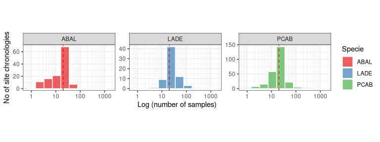
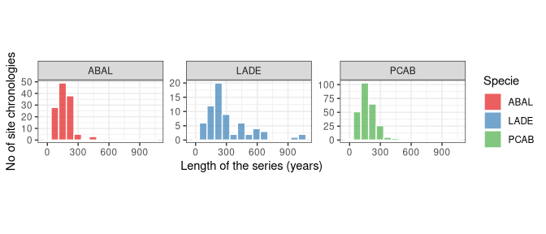
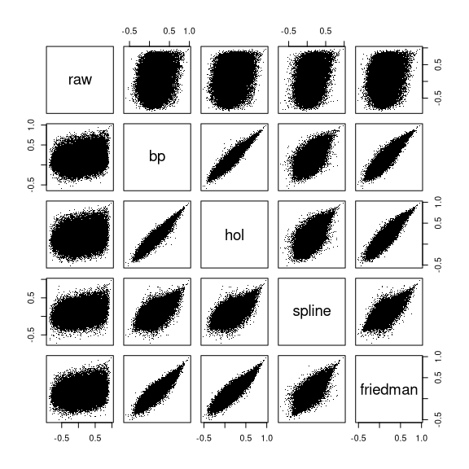
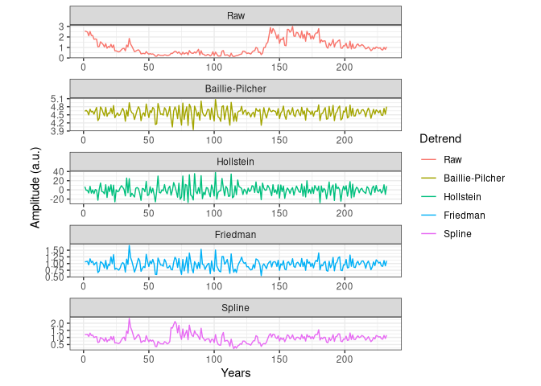
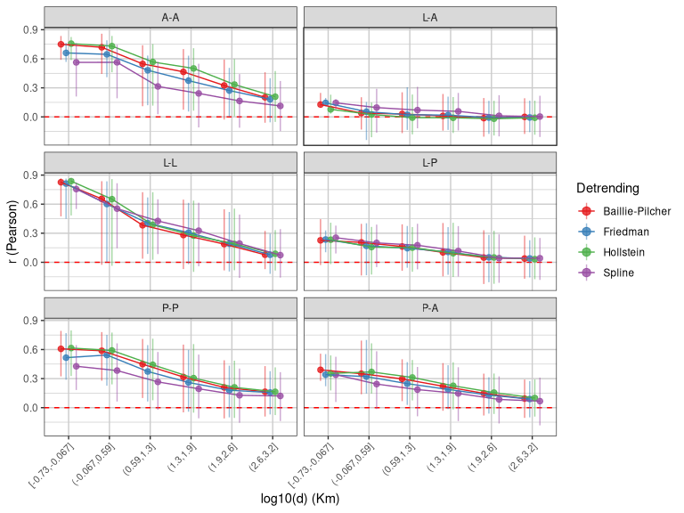
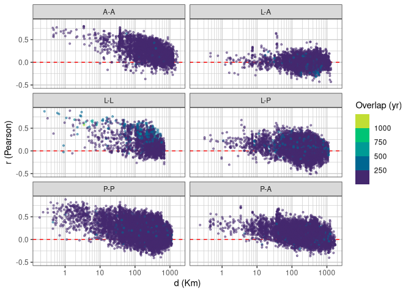
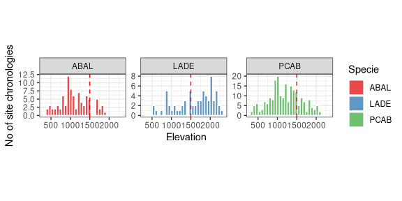
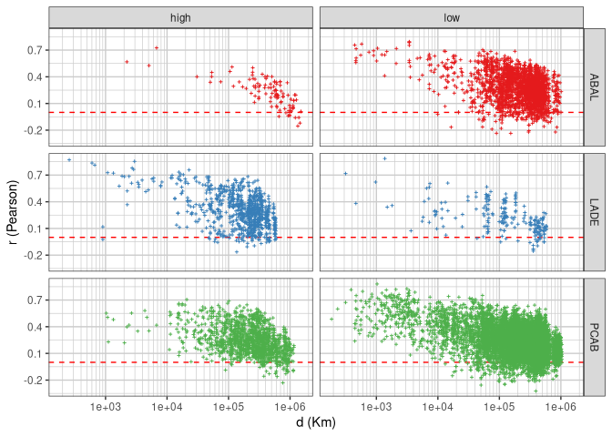
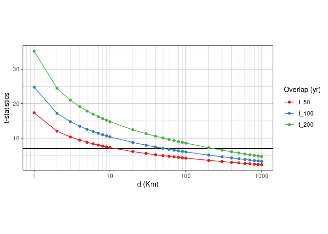
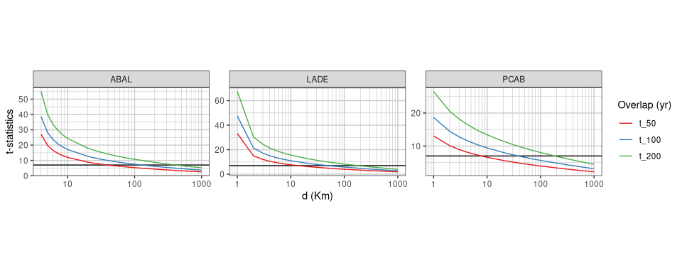

readme
================
Pietro Franceschi
2025-03-20

## Introduction

This md file documents the data analysis workflow used to produce the
results presented in two papers:

- <a href="https://www.esempio.com" target="_blank">*Correlation between
  tree-ring series as a dendroprovenancing evaluation tool*</a> Bernabei
  M., Franceschi P., 2024. Science of the Total Environment, 954: 176516

- M Bernabei and P. Franceschi *Reconsidering the use of t statistic in
  Dendroprovenancing*, in preparation

The first paper reports on an extensive study realized on a subset of
the data available at the International Tree Ring Data Bank which
investigate potential and the pitfalls of correlation analysis in
dendroprovenancing. In the paper the authors propose the use of quantile
regression to perform approximate dendroprovenancing starting from
Pearson correlation values.

The second paper extends the proposed approach to the t-statistic,
highlighting the effects of series overlap on this widely used statistic
in dendrochronology for cross-dating and, at least in preliminary
stages, for dendroprovenancing.

## Includes

This is the set of libraries required to perform the analyses

``` r
library(dplR)                
library(tidyverse)
library(sf)
library(knitr)
library(magrittr)
library(quantreg)
library(colorspace)
library(jtools)
library(broom)
library(zoo)
```

## Data

11,972 individual, raw and georeferenced tree ring series, referring to
three important Alpine species, Norway spruce (Picea abies Karst.,
PCAB), larch (Larix decidua Mill., LADE) and silver fir (Abies alba
Mill., ABAL), were downloaded from the ITRDB site ([International Tree
Ring Data Bank, United States’ National Oceanic and Atmospheric
Administration Paleoclimatology Program and World Data Center for
Paleoclimatology](https://www.ncei.noaa.gov/products/paleoclimatology/tree-ring)
(Guiterman et al., 2024).

The data were organised into a complete tibble which is made available
in the repository (`full_series.RData`).

``` r
## load the dataset
load("full_series.RData")

## print the column names
colnames(dat)
```

    ## [1] "meta"       "study_code" "specie"     "geotype"    "minelev"   
    ## [6] "maxelev"    "geometry"   "rwl"

- `meta`: the metainformation present in the NOAA db.
- `study_code`: the identifier of the study
- `specie`: the tree specie code
- `geotype`: the type of geographical object (here always a POINT)
- `minelev`,`maxelev`: the altitude boundaries of the series, if present
- `geometry`: the coordinates of the series
- `rwl`: the rwl object containing the single tree ring data

For plotting a shapefile of Europe is also included

``` r
load("euro_shape.RData")
```

## Specific R functions

To better streamline the analysis workflow we coded a set of functions
which are included in the `additional_functions.R` file. In particular:

- `calculate_matching`: This function efficiently calculates matching
  metrics between different series organized in a rwl object.
- `averager`: uses the `chron` function of `dplR` to calculate an
  *average* rwl object from a sett of tree ring chronologies
- `log10_minor_break` : allows to add log spaced grid to a ggplot object
- `bp_transform`: apply the detrending included in the prcedure proposed
  by Baillie and Pilcher
- `holl_transform`: apply the detrending proposed by Hollstein

``` r
source("additional_functions.R")
```

## Series pre-processing

The objective of this section is:

- detrend and combine the individual tree ring data in a coherent way
  exploring the effects of the different detrending
- assess the dataset distribution in terms of replication, length of the
  series, species distribution

Let’s start with an initial assessment of the size of the dataset. We
are dealing here with

``` r
nrow(dat)
```

    ## [1] 447

series with the following species distribution

``` r
table(dat$specie)
```

    ## 
    ## ABAL LADE PCAB 
    ##  124   67  256

In terms of spatial coverage at the continental scale:

``` r
geo_area %>% 
  ggplot() + 
  geom_sf() + 
  geom_sf(data = dat, aes(col = specie), size = 1, alpha = 0.5) + 
  scale_color_brewer(palette = "Set1", name = "Specie") + 
  facet_wrap(~specie) + 
  theme_bw() + 
  theme(legend.position = "none")
```

<!-- -->

We also calculate the total number of tree ring series we are dealing
with

``` r
## add a column withe the samples per series
dat <- dat %>% 
  mutate(nsamp = map_int(rwl, ~ncol(.x))) 

## calculate the total number of tree ring series
sum(dat$nsamp)
```

    ## [1] 11972

``` r
dat %>% 
  ggplot() + 
  geom_histogram(aes(x = nsamp, fill = specie), col  ="white", alpha = 0.7, bins  = 10) + 
  scale_fill_brewer(palette = "Set1", name = "Specie") + 
  geom_vline(xintercept = 20, col = "red", lty = 2) +
  facet_wrap(~specie, scales = "free_y") + 
  theme_bw() + 
  scale_x_log10(minor_breaks=log10_minor_break()) + 
  xlab("Log (number of samples)") +
  ylab("No of site chronologies") +
  theme(aspect.ratio = 0.5)
```

<!-- -->

So we see that on average we are dealing with around 25 samples per
series. Here a table with a more complete summary of the series
statistics

``` r
dat %>% 
  group_by(specie) %>% 
  st_drop_geometry() %>% 
  summarise(min_samp = min(nsamp),
            max_samp = max(nsamp),
            mean_nsamp = mean(nsamp)) %>% 
  kable("pipe")
```

| specie | min_samp | max_samp | mean_nsamp |
|:-------|---------:|---------:|-----------:|
| ABAL   |        2 |     1248 |   27.61290 |
| LADE   |        5 |      141 |   29.14925 |
| PCAB   |        1 |      324 |   25.76172 |

On the individual series we now apply the following pipeline:

- we detrend the individual series with four different methods (Baille
  and Pilcher, Hollstein, spline based and Friedman)
- we calculate the mean chronology for all series and all detrendings

We have a limited numbers of warnings, not a lot I would say. The
problem is in general due to the presence of bumpy trends that cannot be
efficiently eliminated.

We calculate the mean chronology

And we arrange everything into tibble of masters

``` r
master <- tibble(detrend = c("raw","bp","hol","spline","friedman"),
                 master = list(
                   combine.rwl(dat$mean_chron),
                   combine.rwl(dat$mean_chron_bp),
                   combine.rwl(dat$mean_chron_hol),
                   combine.rwl(dat$mean_chron_spline),
                   combine.rwl(dat$mean_chron_fried)
                 ))
names(master$master) <- master$detrend
```

Can we say something about the length of the master?

``` r
master$master$bp %>% 
  rownames_to_column("year") %>% 
  mutate(year = as.numeric(year)) %>% 
  mutate(across(-year, ~ as.numeric(!is.na(.x)))) %>% 
  pivot_longer(-year, names_to = "study_code") %>% 
  filter(value > 0) %>% 
  group_by(study_code) %>% 
  summarise(serie_length = length(year)) %>% 
  left_join(dat %>% select(study_code, specie)) %>% 
  ggplot() + 
  geom_histogram(aes(x = serie_length, fill = specie), col  ="white", alpha = 0.7, bins  = 15) + 
  scale_fill_brewer(palette = "Set1", name = "Specie") + 
  facet_wrap(~specie, scales = "free_y") + 
  theme_bw() + 
  #scale_x_log10(minor_breaks=log10_minor_break()) + 
  xlab("Length of the series (years)") + 
  ylab("No of site chronologies") +
  theme(aspect.ratio = 0.5)
```

    ## Joining with `by = join_by(study_code)`

<!-- --> It is nice
to extract a table with the characteristics of the dataset

``` r
master$master$friedman %>% 
  rownames_to_column("year") %>% 
  mutate(year = as.numeric(year)) %>% 
  mutate(across(-year, ~ as.numeric(!is.na(.x)))) %>% 
  pivot_longer(-year, names_to = "study_code") %>% 
  filter(value > 0) %>% 
  group_by(study_code) %>% 
  summarise(serie_length = length(year)) %>% 
  left_join(dat %>% select(study_code, specie)) %>% 
  group_by(specie) %>% 
  summarise(min_length = min(serie_length),
            max_length = max(serie_length),
            mean_length = mean(serie_length)) %>% 
  kable("pipe")
```

    ## Joining with `by = join_by(study_code)`

| specie | min_length | max_length | mean_length |
|:-------|-----------:|-----------:|------------:|
| ABAL   |         46 |        424 |    174.2097 |
| LADE   |         43 |       1062 |    320.0896 |
| PCAB   |         24 |        699 |    178.8242 |

We now need a plot to show the full set of series …

``` r
master$master$friedman %>% 
  rownames_to_column("year") %>% 
  mutate(year = as.numeric(year)) %>% 
  mutate(across(-year, ~ as.numeric(!is.na(.x)))) %>% 
  pivot_longer(-year, names_to = "study_code") %>% 
  filter(value > 0) %>% 
  group_by(study_code) %>% 
  summarise(y_s = min(year), y_m = max(year)) %>% 
  left_join(dat %>% select(study_code, specie)) %>%
  arrange(y_s) %>% 
  mutate(study_code = factor(study_code, levels = study_code)) %>% 
  ggplot() + 
  geom_segment(aes(x = y_s, xend = y_m, y = study_code, yend = study_code, col = specie), lwd = 0.5) + 
  coord_flip() + 
  scale_color_brewer(palette = "Set1", name = "Specie") + 
  theme_bw() + 
  xlab("Year") + 
  ylab("Series") +
   theme(axis.text.x=element_blank(),
         axis.ticks.y=element_blank(),
        aspect.ratio = 0.3
        )
```

    ## Joining with `by = join_by(study_code)`

<!-- -->

## Correlation analysis of the series

Here we calculate the matching among all masters, to be conservative we
consider only couples which are superimposing more than 50 years. Since
we have five sets of masters associated to different detrending methods
this is quite a slow task …

``` r
master <- master %>% 
  mutate(matching = map(master, ~ calculate_matching(.x, sup = 50),
                        .progress = list(
                          type = "iterator", 
                          format = "Calculating {cli::pb_bar} {cli::pb_percent}",
                          clear = TRUE)))
```

    ## Calculating ■■■■■■■ 20%Calculating ■■■■■■■■■■■■■ 40%Calculating
    ## ■■■■■■■■■■■■■■■■■■■ 60%Calculating ■■■■■■■■■■■■■■■■■■■■■■■■■ 80%

A natural question that could be addressed using the full set of
matching deals with the overall similarity of matches calculated with
different detrending methods. This provides an indirect measure of the
effects of detrending on correlation analysis. We can anticipate that
these effects are expected to be significant.

``` r
## first we find common couples
common_couples <- master %>% 
  select(detrend,matching) %>% 
  unnest(matching) %>% 
  na.omit() %>% 
  count(series) %>% 
  filter(n == 5) %>% 
  pull(series)
  
## then we transofr everything into a nice tibble
mtc_tibble <- master %>%
  select(detrend,matching) %>% 
  unnest(matching) %>% 
  filter(series %in% common_couples) %>% 
  pivot_longer(c(lng,cor)) %>% 
  mutate(name = paste0(detrend,"_",name)) %>% 
  select(-detrend) %>% 
  pivot_wider(names_from = name, values_from = value) 

head(mtc_tibble)
```

    ## # A tibble: 6 × 11
    ##   series    raw_lng raw_cor bp_lng  bp_cor hol_lng hol_cor spline_lng spline_cor
    ##   <chr[1d]>   <dbl>   <dbl>  <dbl>   <dbl>   <dbl>   <dbl>      <dbl>      <dbl>
    ## 1 germ066_…      69 -0.298      65  0.539       68  0.638          69     0.117 
    ## 2 germ066_…      75  0.0449     71 -0.0850      74 -0.109          75    -0.158 
    ## 3 germ066_…      75 -0.458      71 -0.0161      74 -0.0944         75    -0.174 
    ## 4 germ066_…      75  0.0572     71 -0.140       74 -0.204          75    -0.0536
    ## 5 germ066_…      75  0.0923     71 -0.155       74 -0.133          75    -0.0105
    ## 6 germ066_…      63  0.577      59  0.100       62 -0.0385         63    -0.0299
    ## # ℹ 2 more variables: friedman_lng <dbl>, friedman_cor <dbl>

And now we are ready for a nice looking correlation plot

``` r
mtc_tibble %>% 
  select(-ends_with("lng")) %>% 
  column_to_rownames("series") %>% 
  rename_with(.fn = function(nm) gsub("_cor","",nm)) %>% 
  as.matrix(.) %>% 
  pairs(., pch = ".")
```

<!-- -->

This clearly indicate the effect of the choice of the detrending method
on the series correlation matrix. The row signals are clearly
uncorrelated with the detrended ones. Among the four types of
detrending, Hollstein and Baille - Pilcher shows an high level of
correlation. They also give results which are coherent with Friedman,
while spline seems to yield a rather different pattern of similarity.

The previous plot highlights the effects of tetrending on the
correlation across the full dataset, it would be interesting also to
give a look to the effect of the detrending on the correlation one
individual series. In other words: how similar is a serie with the
detrended version of itself?

``` r
## calculate the full set of intra series correlations
intra_serie_correlations <- master %>% 
  select(detrend,master) %>% 
  unnest_wider(master) %>% 
  pivot_longer(-detrend) %>% 
  nest(data = -name) %>% 
  mutate(dat_mat = map(data, function(d) {
    m <- do.call(cbind,d$value)
    m <- na.omit(m)
    colnames(m) <- d$detrend
    m
    
  })) %>% 
  select(-data)
```

``` r
reg <- function(x, y, ...) {
  points(x,y, ...)
  abline(lm(y~x)) 
  }# made to draw regression line instead of lowess line

panel.cor <- function(x, y, digits = 2, prefix = "", cex.cor, ...)
{
  usr_old <- par("usr")
  par(usr = c(0, 1, 0, 1))
  r <- abs(cor(x, y))
  txt <- format(c(r, 0.123456789), digits = digits)[1]
  txt <- paste0(prefix, txt)
  text(0.5, 0.5, txt, cex = 1, font = 1)
  par(usr = usr_old)
}
#EXAMPLE OF USE:
pairs(intra_serie_correlations$dat_mat[[5]], upper.panel = reg, # replace HERE for panel.smooth #
      cex = 1, pch = 19, col = adjustcolor(4, .4), cex.labels = 1, font.labels = 1, lower.panel = panel.cor)
```

<!-- -->

The previous plot - obtained on a specific series - shows results which
are slightly different with the overall pictures already discussed. Raw
data are very much different from the detrended ones, but here Friedman
and BP seems to give highly similar results while Hollstein and spline
looks different.

Remember that in the previous plot each blue dot id the value of one
year growth, while in the previous correlation plot each dot was the
comparison between a couple of series.

In terms of “ecological” interpretation of these observations, it is not
surprising that similarity depends on the detrending. Different choices
will indeed remove time feature of different “frequency” highlighting
the importance of short/medium/long scale ecological patterns on the
similarity.

On this respect, however, it is important to highlight that for these
reasons dendroprovenance could give more reliable results with a
specific detrending method … buth the best one cannot be decided “a
priori”.

Just to visually demonstrate what we just discussed here we show aplot
of the effects of setrending on a specific serie:

``` r
intra_serie_correlations$dat_mat[[5]] %>% 
  as_tibble() %>% 
  rownames_to_column("index") %>% 
  mutate(index = as.numeric(index)) %>% 
  pivot_longer(-index, names_to = "Detrend") %>% 
  mutate(Detrend = factor(Detrend, levels = c("raw","bp","hol","friedman","spline"),
                          labels = c("Raw","Baillie-Pilcher","Hollstein","Friedman","Spline"))) %>% 
  ggplot() + 
  geom_line(aes(x = index, y = value, col = Detrend)) + 
  facet_wrap(~Detrend, ncol = 1, scales = "free") + 
  ylab("Amplitude (a.u.)") + 
  xlab("Years") + 
  theme_bw() + 
  theme(aspect.ratio = 0.1)
```

<!-- -->

We clearly see:

- as expected raw data show large bumps
- spline detrending is not able to completely remove them
- the other three detrending strategies are able to remove multi year
  trends

## Association between series similarity and geographical distance

We now couple the physical distances to the correlation matrix

``` r
dist_mat <-  dat%>% 
  st_distance() 
rownames(dist_mat) <- dat$study_code
colnames(dist_mat) <- dat$study_code


dist_tibble <- dist_mat %>% 
  as_tibble(rownames = "s1") %>% 
  pivot_longer(-s1, names_to = "s2", values_to = "d") %>% 
  mutate(series = paste0(s1,"__",s2)) %>% 
  mutate(d = as.vector(d)/1000) %>% 
  filter(d > 0.01) %>% left_join(dat%>% st_drop_geometry() %>% 
              select(study_code,specie), by = c("s1" = "study_code")) %>% 
  left_join(dat %>% st_drop_geometry() %>% 
              select(study_code,specie), by = c("s2" = "study_code")) %>% 
  mutate(couple_id = case_when(specie.x == "LADE" & 
                                 specie.y == "LADE" ~ "L-L",
                               specie.x == "PCAB" & 
                                 specie.y == "PCAB" ~ "P-P",
                               specie.x == "ABAL" & 
                                 specie.y == "ABAL" ~ "A-A",
                               specie.x == "LADE" & 
                                 specie.y == "PCAB" ~ "L-P",
                               specie.y == "LADE" & 
                                 specie.x == "PCAB" ~ "L-P",
                               specie.x == "LADE" & 
                                 specie.y == "ABAL" ~ "L-A",
                               specie.y == "LADE" & 
                                 specie.x == "ABAL" ~ "L-A",
                               specie.x == "PCAB" & 
                                 specie.y == "ABAL" ~ "P-A",
                               specie.y == "PCAB" & 
                                 specie.x == "ABAL" ~ "P-A",
                               )) 
  
  
## adding correlation similarity
dist_tibble <- dist_tibble %>% 
  right_join(mtc_tibble) %>% 
  mutate(min_overlap = pmin(raw_lng,bp_lng,hol_lng,spline_lng,friedman_lng)) %>% 
  select(-ends_with("lng"))
```

    ## Joining with `by = join_by(series)`

To show the complex interplay between the distance and the detrending we
highlight in a plot the association between the correlation and the
distance. To mak ethe plot clearer we bin the distance axis

``` r
dist_tibble %>% 
  pivot_longer(ends_with("cor")) %>% 
  filter(name != "raw_cor") %>% 
  na.omit() %>% 
  mutate(name = case_when(name == "bp_cor" ~ "Baillie-Pilcher",
                          name == "hol_cor" ~ "Hollstein",
                          name == "friedman_cor" ~ "Friedman",
                          name == "spline_cor" ~ "Spline")) %>% 
  mutate(couple_id = factor(couple_id, 
                            levels = c("A-A","L-A","L-L","L-P","P-P","P-A"))) %>% 
  mutate(dist_int = cut_interval(log10(d),6,dig.lab = 0)) %>% 
  group_by(dist_int,name, couple_id) %>% 
  summarise(median = median(value),
            q95 = quantile(value, 0.95),
            q5 = quantile(value,0.05)) %>% 
  #mutate(length_tile = factor(cut(lng,2))) %>% 
  ggplot() + 
  geom_hline(yintercept = 0, col  ="red", lty = 2) + 
  geom_point(aes(x = dist_int, y = median, col = name), alpha = 0.8, size = 2, position = position_dodge(width = 0.5)) + 
  geom_line(aes(x = dist_int, y = median, col = name, group = name), position = position_dodge(width = 0.5)) +
  geom_linerange(aes(x = dist_int, ymin = q5, ymax = q95, col = name),position = position_dodge(width = 0.5), alpha = 0.5) +
  scale_color_brewer(palette = "Set1", name = "Detrending") + 
  facet_wrap(~couple_id, ncol = 2) + 
  xlab("log10(d) (Km)") + 
  ylab("r (Pearson)") + 
  #scale_x_log10(minor_breaks=log10_minor_break()) +
  theme_bw() + 
  guides(color = guide_legend(override.aes = list(size = 3))) + 
  theme(
        panel.grid.major=element_line (colour="gray80"), 
        panel.grid.minor=element_line(colour="gray80"),
        axis.text.x = element_text(size = 8, angle = 45, hjust = 1))
```

    ## `summarise()` has grouped output by 'dist_int', 'name'. You can override using
    ## the `.groups` argument.

<!-- -->

Even if it is complex the previous plot is extremely informative.

- In all cases correlation is negatively associated with geographic
  distance
- The strength of this association depends on the species we are
  comparing. e.g. on Larix - Larix the effect is stronger than on
  Larix - Abies
- Different detrending behave differently,a nd in general spline seems
  to be less effective in highlighting this trend.

The previous plot highlights general trends, but it cannot be directly
used for dendroprovencance since it highlights “average” trends. To
better pintpoint this aspect let’s give a look to the full plot of the
similarity between the series after Friedman detrending

``` r
dist_tibble %>%  
  na.omit() %>% 
  mutate(couple_id = factor(couple_id, 
                            levels = c("A-A","L-A","L-L","L-P","P-P","P-A"))) %>% 
  #mutate(length_tile = factor(cut(lng,2))) %>% 
  ggplot() + 
  geom_hline(yintercept = 0, col  ="red", lty = 2) + 
  geom_point(aes(x = d, y = friedman_cor, col = min_overlap), alpha = 0.5, size = 0.8) + 
  scale_color_binned_sequential(palette = "viridis", rev = FALSE, name = "Overlap (yr)") + 
  facet_wrap(~couple_id, ncol = 2) + 
  xlab("d (Km)") + 
  ylab("r (Pearson)") + 
  scale_x_log10(minor_breaks=log10_minor_break()) +
  theme_bw() + 
  theme(
        panel.grid.major=element_line (colour="gray80"), 
        panel.grid.minor=element_line(colour="gray80"))
```

<!-- -->

The plot shows the expected trend. The correlation increases at small
distances and the extent of this association depends on the nature of
the couple. What clearly stands out from the previous plot is that even
if large correlations can be observed only at short distances, the
reverse is not true: short distances can also be associated to “small”
correlations. In other words, high correlations are always informative
about distance, while low correlations are not. This observation makes
perfectly sense and it is basically telling us: if you want to develop a
quantitative model which uses correlation for dendroprovenanceing you
should concentrate on modeling high correlations as a function of
distance.

In order to do that our idea is to fit a quantile regression line to the
cloud of points and this model will be useful to set an upper boundary
to the correlation which can be measured for each distance.

Here we focus on the three homologous couples

``` r
dist_tibble %>%  
  na.omit() %>% 
  filter(couple_id %in% c("A-A","L-L","P-P")) %>% 
  ggplot() + 
  geom_hline(yintercept = 0, col  ="red", lty = 2) + 
  geom_point(aes(x = d, y = friedman_cor, col = couple_id), alpha = 0.8, pch = 1, cex = 0.8) + 
  #scale_shape_manual(values = c(1,3,5)) + 
  scale_color_discrete_qualitative(palette = "Dark2") + 
  xlab("d (Km)") + 
  ylab("r (Pearson)") + 
  scale_x_log10(minor_breaks=log10_minor_break()) +
  theme_bw() + 
  theme(
        panel.grid.major=element_line (colour="gray80"), 
        panel.grid.minor=element_line(colour="gray80"), 
        aspect.ratio = 0.3)
```

<!-- -->

We apply a quantile regression approach to identify a 95% regression
limit which can be used to estimate a distance from the correlation. We
do it putting the species together and as a function of the type of
detrending

We want confidence intervals. So we use bootstrap on the data to do that
we use the jtool package and we calculate bootstrap confidence intervals
for the model coefficients

``` r
full_qr <- dist_tibble %>%  
  na.omit() %>% 
  filter(couple_id %in% c("A-A","L-L","P-P")) %>% 
  select(d, ends_with("cor")) %>% 
  pivot_longer(ends_with("cor")) %>% 
  nest(data = -name) %>% 
  mutate(quantreg = map(data,~ rq(value ~ log10(d), tau = c(0.95,0.9), data = .x), 
                        .progress = list(
                          type = "iterator", 
                          format = "Calculating {cli::pb_bar} {cli::pb_percent}",
                          clear = TRUE))) %>% 
  mutate(coefs = map(quantreg, ~ tidy(.x, conf.int = TRUE, se.type = "boot"), .progress = list(
                          type = "iterator", 
                          format = "Calculating {cli::pb_bar} {cli::pb_percent}",
                          clear = TRUE)))
```

    ## Calculating ■■■■■■■ 20%Calculating ■■■■■■■■■■■■■ 40%Calculating
    ## ■■■■■■■■■■■■■■■■■■■ 60%Calculating ■■■■■■■■■■■■■■■■■■■■■■■■■ 80%

The following plot shows the quantile regression line and the arrows
illustrate how the line can be used to estimate the distance from a
correlation value. As discussed in the paper, suppose that the
correlation between an unknown series and a reference one turns out to
be 0.75. The figure indicates that this level of similarity is unlikely
to be found for distances larger than 7 km, so this distance can be used
to perform an approximate dendroprovenance.

``` r
dist_tibble %>%  
  na.omit() %>% 
  filter(d > 0) %>% 
  filter(couple_id %in% c("A-A","L-L","P-P")) %>% 
  bind_cols(predict(full_qr$quantreg[[5]], full_qr$data[[5]])) %>% 
  ggplot() + 
  geom_hline(yintercept = 0, col  ="red") + 
  geom_point(aes(x = d, y = friedman_cor, col = couple_id, pch = couple_id), alpha = 0.5, size = 0.6) + 
  geom_line(aes(x = d, y = `tau= 0.95`), col = "darkred") + 
  #geom_line(aes(x = d, y = lower), col = "red", alpha =  0.6, lwd = 0.5) + 
  #geom_line(aes(x = d, y = higher), col = "red", alpha =  0.6, lwd = 0.5) + 
  geom_segment(aes(x = 0.5, xend = 7, y = 0.75, yend = 0.75), arrow = arrow(length = unit(0.2, "cm"))) + 
  geom_segment(aes(x = 7, xend = 7, y = 0.75, yend = 0), arrow = arrow(length = unit(0.2, "cm"))) + 
  scale_shape_manual(values = c(1,3,4), name = "Couple id") + 
  scale_color_brewer(palette = "Set1", name = "Couple id") + 
  xlab("d (Km)") + 
  ylab("r (Pearson)") + 
  scale_x_log10(minor_breaks=log10_minor_break()) +
  theme_bw() + 
  theme(
        panel.grid.major=element_line (colour="gray80"), 
        panel.grid.minor=element_line(colour="gray80"), 
        aspect.ratio = 0.3)
```

    ## Warning in geom_segment(aes(x = 0.5, xend = 7, y = 0.75, yend = 0.75), arrow = arrow(length = unit(0.2, : All aesthetics have length 1, but the data has 29823 rows.
    ## ℹ Please consider using `annotate()` or provide this layer with data containing
    ##   a single row.

    ## Warning in geom_segment(aes(x = 7, xend = 7, y = 0.75, yend = 0), arrow = arrow(length = unit(0.2, : All aesthetics have length 1, but the data has 29823 rows.
    ## ℹ Please consider using `annotate()` or provide this layer with data containing
    ##   a single row.

<!-- -->

We now want to have nice outputs for each one of the couples, and create
a nice looking table and plot for the supplementary

``` r
table_full_qr <- full_qr %>%
  select(name, coefs) %>%
  unnest(coefs) %>%
  rename("Detrending" = "name") %>%
  mutate(
    Detrending = case_when(
      Detrending == "bp_cor" ~ "Baillie-Pilcher",
      Detrending == "hol_cor" ~ "Hollstein",
      Detrending == "friedman_cor" ~ "Friedman",
      Detrending == "spline_cor" ~ "Spline",
      Detrending == "raw_cor" ~ "no detrend"
    )
  ) %>%
  select(-c("statistic", "p.value", "std.error")) %>%
  mutate(term = case_when(term == "(Intercept)" ~ "b", term == "log10(d)" ~ "a")) %>%
  rename(
    "Term" = "term",
    "Conf.low" = "conf.low",
    "Conf.high" = "conf.high",
    "Values" = "estimate",
    "Quantile" = "tau"
  ) %>%
  mutate(across(-c("Term","Detrending"),  ~ round(.x, 2))) 

table_full_qr %>% 
  kable("pipe")
```

| Detrending      | Term | Values | Conf.low | Conf.high | Quantile |
|:----------------|:-----|-------:|---------:|----------:|---------:|
| no detrend      | b    |   0.73 |     0.70 |      0.76 |     0.90 |
| no detrend      | a    |  -0.06 |    -0.07 |     -0.05 |     0.90 |
| no detrend      | b    |   0.81 |     0.78 |      0.83 |     0.95 |
| no detrend      | a    |  -0.05 |    -0.06 |     -0.04 |     0.95 |
| Baillie-Pilcher | b    |   0.93 |     0.91 |      0.95 |     0.90 |
| Baillie-Pilcher | a    |  -0.20 |    -0.21 |     -0.20 |     0.90 |
| Baillie-Pilcher | b    |   0.99 |     0.97 |      1.01 |     0.95 |
| Baillie-Pilcher | a    |  -0.21 |    -0.22 |     -0.20 |     0.95 |
| Hollstein       | b    |   0.95 |     0.93 |      0.97 |     0.90 |
| Hollstein       | a    |  -0.22 |    -0.22 |     -0.21 |     0.90 |
| Hollstein       | b    |   1.01 |     0.99 |      1.02 |     0.95 |
| Hollstein       | a    |  -0.21 |    -0.22 |     -0.21 |     0.95 |
| Spline          | b    |   0.72 |     0.70 |      0.74 |     0.90 |
| Spline          | a    |  -0.15 |    -0.16 |     -0.15 |     0.90 |
| Spline          | b    |   0.80 |     0.78 |      0.82 |     0.95 |
| Spline          | a    |  -0.16 |    -0.17 |     -0.16 |     0.95 |
| Friedman        | b    |   0.85 |     0.83 |      0.87 |     0.90 |
| Friedman        | a    |  -0.20 |    -0.20 |     -0.19 |     0.90 |
| Friedman        | b    |   0.91 |     0.90 |      0.93 |     0.95 |
| Friedman        | a    |  -0.20 |    -0.21 |     -0.19 |     0.95 |

To facilitate the comparison the previous data can be also visualized in
graphical form:

``` r
full_qr %>%
  select(name, coefs) %>%
  unnest(coefs) %>%
  rename("Detrending" = "name") %>%
  mutate(
    Detrending = case_when(
      Detrending == "pb_cor" ~ "BP",
      Detrending == "hol_cor" ~ "Hollstein",
      Detrending == "friedman_cor" ~ "Friedman",
      Detrending == "spline_cor" ~ "Spline",
      Detrending == "raw_cor" ~ "no detrend"
    )
  ) %>%
  select(-c("statistic", "p.value", "std.error")) %>%
  mutate(term = case_when(term == "(Intercept)" ~ "b", term == "log10(d)" ~ "a")) %>% 
  rename("Quantile" = "tau") %>% 
  mutate(Quantile = factor(Quantile)) %>% 
  ggplot() + 
  geom_point(aes(x = Detrending, y = estimate, col = Quantile), position = position_dodge(width = 0.5)) + 
  geom_linerange(aes(x = Detrending, ymin = `conf.low`, ymax = `conf.high`, col = Quantile), position = position_dodge(width = 0.5)) + 
  facet_wrap(~term, scales = "free") + 
  xlab("") + 
  theme_bw() + 
  theme(aspect.ratio = 0.7,
        panel.grid.major.x = element_line(colour = "gray50", linetype = 2))
```

<!-- -->

For practical applications we now calculate the quantile regression for
the individual species by using a Friedman detrend as discussed in the
STOTEN paper

``` r
fried_qr <- dist_tibble %>%  
  na.omit() %>% 
  filter(couple_id %in% c("A-A","L-L","P-P")) %>% 
  select(d, couple_id,friedman_cor) %>% 
  nest(data = -couple_id) %>% 
  mutate(quantreg = map(data,~ rq(friedman_cor ~ log10(d), tau = c(0.95,0.9), data = .x), 
                        .progress = list(
                          type = "iterator", 
                          format = "Calculating {cli::pb_bar} {cli::pb_percent}",
                          clear = TRUE))) %>% 
  mutate(coefs = map(quantreg, ~ tidy(.x, conf.int = TRUE, se.type = "boot"), .progress = list(
                          type = "iterator", 
                          format = "Calculating {cli::pb_bar} {cli::pb_percent}",
                          clear = TRUE)))
```

    ## Calculating ■■■■■■■■■■■ 33%Calculating ■■■■■■■■■■■■■■■■■■■■■ 67%

And we supparise the outputs in a table

``` r
fried_qr %>%
  select(couple_id, coefs) %>%
  unnest(coefs) %>%
  select(-c("statistic", "p.value", "std.error")) %>%
  mutate(term = case_when(term == "(Intercept)" ~ "b", term == "log10(d)" ~ "a")) %>%
  rename(
    "Term" = "term",
    "Conf.low" = "conf.low",
    "Conf.high" = "conf.high",
    "Values" = "estimate",
    "Quantile" = "tau",
    "Couple_id" = "couple_id"
  ) %>%
  mutate(across(-c("Term", "Couple_id"),  ~ round(.x, 2))) %>%
  kable("pipe")
```

| Couple_id | Term | Values | Conf.low | Conf.high | Quantile |
|:----------|:-----|-------:|---------:|----------:|---------:|
| A-A       | b    |   0.97 |     0.92 |      1.02 |     0.90 |
| A-A       | a    |  -0.22 |    -0.25 |     -0.20 |     0.90 |
| A-A       | b    |   0.99 |     0.94 |      1.04 |     0.95 |
| A-A       | a    |  -0.22 |    -0.24 |     -0.19 |     0.95 |
| L-L       | b    |   1.01 |     0.94 |      1.07 |     0.90 |
| L-L       | a    |  -0.26 |    -0.29 |     -0.23 |     0.90 |
| L-L       | b    |   0.99 |     0.93 |      1.06 |     0.95 |
| L-L       | a    |  -0.22 |    -0.25 |     -0.19 |     0.95 |
| P-P       | b    |   0.80 |     0.78 |      0.81 |     0.90 |
| P-P       | a    |  -0.18 |    -0.18 |     -0.17 |     0.90 |
| P-P       | b    |   0.88 |     0.86 |      0.90 |     0.95 |
| P-P       | a    |  -0.19 |    -0.20 |     -0.18 |     0.95 |

## Role of elevation

Altitude difference is known to affect the correlation between series.
In this section we present some considerations on this aspect which can
be drawn because many of the series we have been collecting have also
indications about the altitude of the samples.

``` r
## manually set limits to divade series into high and low altitude
altitude_cutoff <- tibble(specie = c("PCAB","ABAL","LADE"), limit = c(1500,1500,1500))


dat %>% 
  na.omit() %>% 
  ggplot() + 
  geom_histogram(aes(x = maxelev, fill = specie), col = "white", alpha = 0.8,
                 position = position_identity()) + 
  geom_vline(data = altitude_cutoff, mapping = aes(xintercept = limit), col = "red", lty = 2) + 
  scale_fill_brewer(palette = "Set1", name = "Specie") + 
  facet_wrap(~specie, nrow = 1, scales = "free_y") + 
  xlab("Elevation") + 
  ylab("No of site chronologies") + 
  theme_bw() +
  theme(aspect.ratio = 0.5)
```

    ## `stat_bin()` using `bins = 30`. Pick better value with `binwidth`.

<!-- -->

As expected the three species are showing different altitude
distributions. In the case of Larix the majority of the series was
collected at relatively high altitudes, while the situation is reversed
as far as Abies is concerned. The situation for Picea is somehow mixed:
also in this case the majority of the samples were collected at low
altitude even if the number of series measured above 1500 m is not
negligible

Let’s now look to the distance-correlation splitting the series in two
altitude groups focusing on the homologous series:

``` r
altitude_study <- dat %>% 
  st_drop_geometry() %>% 
  na.omit() %>% 
  select(specie,mean_chron_fried,maxelev) %>% 
  nest(data = -specie) %>% 
  left_join(altitude_cutoff) %>% 
  mutate(high = map2(data, limit, function(x,y) {
    one <- x %>% filter(maxelev >= y)
    out <- combine.rwl(one$mean_chron_fried)
    out
    })) %>% 
  mutate(low = map2(data, limit, function(x,y) {
    one <- x %>% filter(maxelev < y)
    out <- combine.rwl(one$mean_chron_fried)
    out
    })) %>% 
  select(specie,high,low) %>% 
  pivot_longer(-specie, values_to = "rwl", names_to = "group")
```

    ## Joining with `by = join_by(specie)`

``` r
## calculate the similarity  
altitude_study <- altitude_study %>% 
  mutate(mtc = map(rwl, ~ calculate_matching(.x, sup = 50)))

altitude_study <- altitude_study %>% 
  mutate(mtc_full = map(mtc, ~ .x %>% 
  separate(series, into = c("s1","s2"), sep = "__") %>% 
  na.omit() %>% 
  mutate(d = map2_dbl(s1,s2, ~ dist_mat[.x,.y]))))

altitude_study %>% 
  select(specie, group, mtc_full) %>% 
  unnest(mtc_full) %>% 
  filter(d > 0) %>% 
  #mutate(couple_id = factor(couple_id, 
  #                          levels = c("P-P","L-L","P-L"))) %>% 
  #mutate(length_tile = factor(cut(lng,2))) %>% 
  ggplot() + 
  geom_hline(yintercept = 0, col  ="red", lty = 2) + 
  geom_point(aes(x = d, y = cor, col = specie), size = 0.5, shape = 3) + 
  scale_color_brewer(palette = "Set1") + 
  facet_grid(specie~group) + 
  scale_x_log10(minor_breaks=log10_minor_break()) +
  scale_y_continuous(breaks=seq(-0.5,1,0.3)) + 
  xlab("d (Km)") + 
  ylab("r (Pearson)") + 
  theme_bw() + 
  theme(
        panel.grid.major=element_line (colour="gray80"), 
        panel.grid.minor=element_line(colour="gray80"),
        legend.position = "none")
```

<!-- --> The previous
plot shows the expected splitting of the species which makes difficult
to draw conclusions for Larix and Abies. In the case of Picea the plot
suggests the presence of a larger fraction of low correlations in the
low altitude group, while the high correlation trends seems to be
comparable even if the number of samples at low distances is
unfortunately too small to draw robust conclusions.

## From r to t

T statistic is often used for dendroproveneance, the fundamental
difference between *t* and *r* arises from the fact that the t statistic
also take into account the overlap between the series. This fact makes t
more “reliable” as measure of similarity because its value tends to
increase as the overall overlap increases. This fact somehow formalizes
the reasonable observation that high similarities between two series are
more trustworthy if the similarity extend over many years.

The mathematical between *t* and *s* is the following:

$$
t = \frac{r \sqrt{n - 2}}{\sqrt{1 - r^2}}
$$

In the previous sections we proposed to use quantile regression to
predict r from d, so our results could be extended to link d and t
considering different scenarios for n. What we would highlight about the
formula is its non linearity in *r* and *n*. This implies that the
quantile regression line will be transformed into a non linear two
dimensional surface. Which in the following will be represented as a set
of iso-n curves.

Let’s start from the visualization of the trends for the quantile
regression line constructed on the data of the three conifers taken
together:

``` r
## dataframe fro the prediction
newdata_full <- tibble(d = c(seq(1,9,1),seq(10,90,10),seq(100,1000,100)))
bp_qr <- full_qr$quantreg[[2]]

## prediction or the t-d relation for overlaps of 50, 100 and 200 years
newdata_full <- newdata_full %>% 
  add_column(r = predict(bp_qr, newdata_full)[,1]) %>% 
  mutate(t_50 = (r*sqrt(50 - 2))/sqrt(1-r^2)) %>% 
  mutate(t_100 = (r*sqrt(100 - 2))/sqrt(1-r^2)) %>% 
  mutate(t_200 = (r*sqrt(200 - 2))/sqrt(1-r^2))


newdata_full %>% 
  select(-r) %>% 
  pivot_longer(starts_with("t")) %>% 
  mutate(name = factor(name, levels = c("t_50","t_100","t_200"))) %>% 
  ggplot() + 
   geom_hline(aes(yintercept = 7), lty = 1) + 
  geom_point(aes(x = d, y = value, col = name)) +
  geom_line(aes(x = d, y = value, col = name)) + 
  scale_color_brewer(palette = "Set1", name = "Overlap (yr)") + 
  scale_x_log10() +
  xlab("d (Km)") + 
  ylab("t-statistics") + 
  scale_x_log10(minor_breaks=log10_minor_break()) +
  theme_bw() + 
  theme(
        panel.grid.major=element_line (colour="gray80"), 
        panel.grid.minor=element_line(colour="gray80"), 
        aspect.ratio = 0.5)
```

    ## Scale for x is already present.
    ## Adding another scale for x, which will replace the existing scale.

<!-- -->

The non linear trend is clear. The same plot also shows the overall
increase of the d-t curve as the number of samples increases. This is in
keeping with the added confidence connected to a longer period in
overlap.

As in the case of the linear relationship discussed above, the
intersection between the horizontal line (corresponding to a t of 7) and
the d-t curves shows the estimated maximal separation of two series
showing a t of 7.

What should be observed here is that the same level of “similarity”
(here 7) returns a different estimate of the maximal distance which
grows as the overlap grows (10km for 50 years, 50 km fro 100 years, 150
km for 200 years). At first sight this result would seem strange, but in
reality it fits with what we expect. In presence of large overlaps a t
of 7 is not informative because we expect more than that if the two
series are really similar.

For practical applications this means that the choice of an
“informative” t for dendroprovenencing is not absolute but should take
into consideration also the series overlap.

At a more subtle inspection, the previous plot also indicate that longer
series should be always preferred. The difference on the ts obtained at
1km and 1000 km is indeed growing as the overlap grows. This implies
that the green curve is more steep and contrasted and this will result
in a more accurate devinition of the spatial separation between two
series.

We conclude this notes by developing the previous analysis for the three
separate species. Since BP detrending coupled with t statistics is often
used in dendrochronological application we perform this analysis on the
BP detrended curves.

``` r
bp_qr_t <- dist_tibble %>%  
  na.omit() %>% 
  filter(couple_id %in% c("A-A","L-L","P-P")) %>% 
  select(d, couple_id,bp_cor) %>% 
  nest(data = -couple_id) %>% 
  mutate(quantreg = map(data,~ rq(bp_cor ~ log10(d), tau = c(0.95,0.9), data = .x), 
                        .progress = list(
                          type = "iterator", 
                          format = "Calculating {cli::pb_bar} {cli::pb_percent}",
                          clear = TRUE))) %>% 
  mutate(coefs = map(quantreg, ~ tidy(.x, conf.int = TRUE, se.type = "boot"), .progress = list(
                          type = "iterator", 
                          format = "Calculating {cli::pb_bar} {cli::pb_percent}",
                          clear = TRUE)))
```

    ## Calculating ■■■■■■■■■■■ 33%Calculating ■■■■■■■■■■■■■■■■■■■■■ 67%

We now add the predictions for the t to each model

``` r
bp_qr_t <- bp_qr_t %>% 
  mutate(t_predictions = map(quantreg, function(x){
    
    newdata <- tibble(d = c(seq(1,9,1),seq(10,90,10),seq(100,1000,100)))
    newdata <- newdata %>% 
      add_column(r = predict(x, newdata)[,1]) %>% 
      mutate(t_50 = (r*sqrt(50 - 2))/sqrt(1-r^2)) %>% 
      mutate(t_100 = (r*sqrt(100 - 2))/sqrt(1-r^2)) %>% 
      mutate(t_200 = (r*sqrt(200 - 2))/sqrt(1-r^2))
    
    return(newdata)
    
  }))
```

    ## Warning: There were 3 warnings in `mutate()`.
    ## The first warning was:
    ## ℹ In argument: `t_50 = (r * sqrt(50 - 2))/sqrt(1 - r^2)`.
    ## Caused by warning:
    ## ! There was 1 warning in `mutate()`.
    ## ℹ In argument: `t_50 = (r * sqrt(50 - 2))/sqrt(1 - r^2)`.
    ## Caused by warning in `sqrt()`:
    ## ! NaNs produced
    ## ℹ Run `dplyr::last_dplyr_warnings()` to see the 2 remaining warnings.

Ok now we prepare a faceted plot with the three species

``` r
bp_qr_t %>% 
  mutate(couple_id = recode(couple_id, "A-A" = "ABAL", "L-L" = "LADE", "P-P" = "PCAB")) %>% 
  select(couple_id,t_predictions) %>% 
  unnest(t_predictions) %>% 
  select(-r) %>% 
  pivot_longer(starts_with("t")) %>% 
  mutate(name = factor(name, levels = c("t_50","t_100","t_200"))) %>% 
  filter(!is.nan(value)) %>% 
  ggplot() + 
  geom_hline(aes(yintercept = 7), lty = 1) + 
  #geom_point(aes(x = d, y = value, col = name)) +
  geom_line(aes(x = d, y = value, col = name)) + 
  facet_wrap(~couple_id, scales = "free") +
  scale_color_brewer(palette = "Set1", name = "Overlap (yr)") + 
  scale_x_log10() +
  xlab("d (Km)") + 
  ylab("t-statistics") + 
  scale_x_log10(minor_breaks=log10_minor_break()) +
  theme_bw() + 
  theme(
        panel.grid.major=element_line (colour="gray80"), 
        panel.grid.minor=element_line(colour="gray80"), 
        aspect.ratio = 0.5)
```

    ## Scale for x is already present.
    ## Adding another scale for x, which will replace the existing scale.

<!-- -->

## Bibliography

- Guiterman C. H., Gille E., Shepherd E., Mcneill S., Payne C. R.,
  Morrill C., 2024. The International Tree-Ring Data Bank at Fifty:
  Status of Stewardship for Future Scientific Discovery. Tree-Ring
  Research, 80 (1): 13-18.
